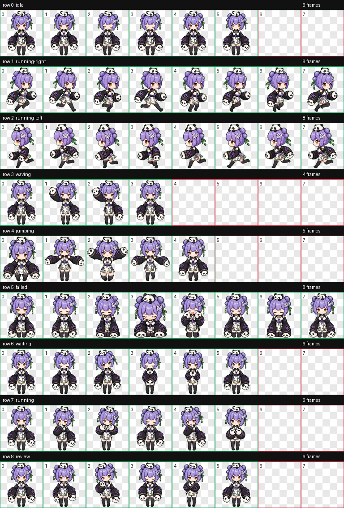

# Codex Pet: Azi

Azi is a panda-themed pixel pet for Codex, based on a character turnaround reference. The pet includes the standard Codex pet animation states: idle, running right, running left, waving, jumping, failed, waiting, running, and review.



## What Is Included

```text
codex-pet-azi/
  README.md
  assets/
    contact-sheet.png
  azi/
    pet.json
    spritesheet.webp
```

The `azi/` folder is the actual pet package. It contains:

- `pet.json`: pet metadata used by Codex.
- `spritesheet.webp`: the 1536 x 1872 animation atlas used by the Codex pet renderer.

## Install In Codex

### 1. Install the Hatch Pet skill, if needed

This pet was built with the Codex `hatch-pet` skill. You do not need the skill just to use the finished pet, but it is useful if you want to create, repair, or rebuild Codex pets later.

If your Codex setup supports skills, install or enable `hatch-pet` from your Codex skills directory or skill installer. After that, Codex can create pets from references and package them into the same format used here.

### 2. Copy the pet folder

Copy the whole `azi` folder into your Codex pets directory.

On Windows, the target path is usually:

```text
C:\Users\<your-user-name>\.codex\pets\azi
```

For example, after installation you should have:

```text
C:\Users\<your-user-name>\.codex\pets\azi\pet.json
C:\Users\<your-user-name>\.codex\pets\azi\spritesheet.webp
```

On macOS or Linux, the target path is usually:

```text
~/.codex/pets/azi
```

### 3. Restart or refresh Codex

Restart Codex, or refresh the pet list if your Codex app provides that option. Azi should then appear as an available custom pet.

## Verify The Install

Open the installed `pet.json` and confirm it points to the spritesheet beside it:

```json
{
  "id": "azi",
  "displayName": "Azi",
  "spritesheetPath": "spritesheet.webp"
}
```

If the pet does not appear, check that the folder name is `azi` and that both `pet.json` and `spritesheet.webp` are directly inside that folder.

## Animation Preview

The contact sheet below shows the frames included in the pet atlas:


## Credits

Created with Codex using the `hatch-pet` workflow from a provided character turnaround reference.
